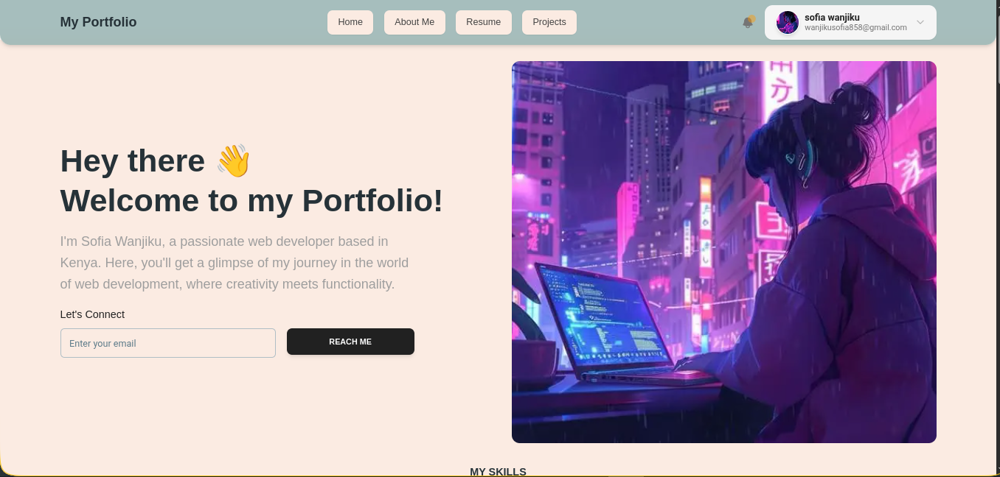

# 🌟 Sofia's  Portfolio

Welcome to my personal developer portfolio!  
Built using **Next.js**, **TypeScript**, **TailwindCSS**, and **Material Tailwind UI**, this project showcases my skills, experience, and the projects I’ve worked on in a clean and modern design.

---

## 🚀 Tech Stack

| Technology        | Description                                  |
|-------------------|----------------------------------------------|
| 🧩 **Next.js**      | React framework for fast server-side rendering |
| 🟦 **TypeScript**   | Strongly typed JavaScript superset          |
| 🎨 **TailwindCSS**  | Utility-first CSS framework for styling     |
| 💠 **Material UI**  | Beautiful UI components via Material Tailwind |

---

## 📸 Screenshot

<!-- Replace with your own screenshot path -->

---

## 🧠 Features

- ✅ Fully responsive and mobile-friendly design  
- 🧭 Sticky Navbar with smooth scroll to sections  
- 👩‍💻 About Me section with short bio and skills  
- 🧰 Projects section with cards for each project  
<!-- - 📰 Blog/Article section (if applicable)   -->
- 📩 Contact form / social links  
<!-- - 💡 Clean animations and transitions  
- 🌙 Dark mode ready (optional) -->

---

## 📂 Project Structure

```bash
.
├── components/         # Reusable components (Navbar, Footer, Cards, etc.)
├── app/                # Next.js pages
├── public/             # Static assets (images, icons, etc.)
├── styles/             # Global styles
├── types/              
├── utils/              
├── tailwind.config.js  
└── tsconfig.json       


# Clone the repository
git clone https://github.com/wamjikusofia/portfolio.git
cd portfolio

# Install dependencies
npm install

# Start the development server
npm run dev

#To create optimized production build
npm run build
npm run start


